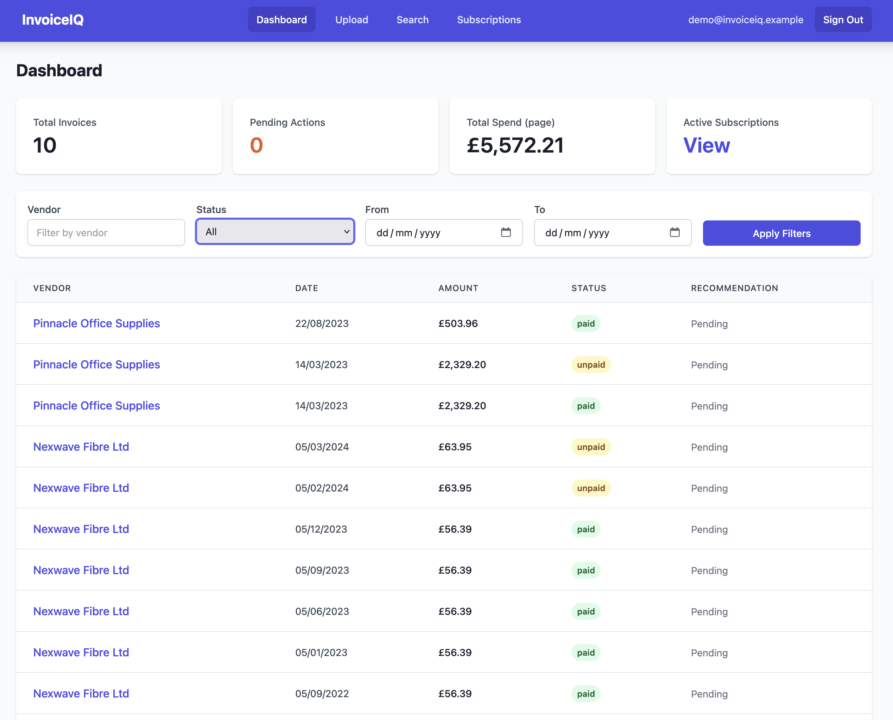
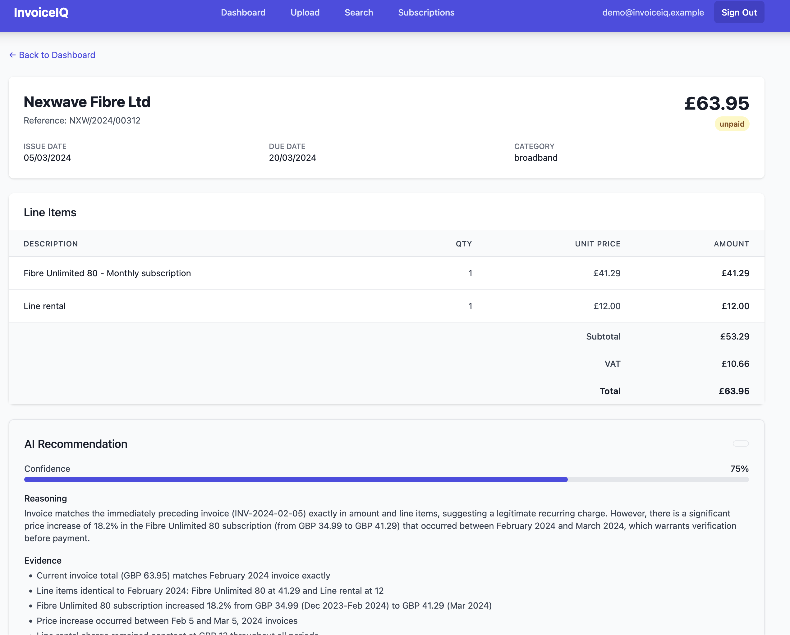
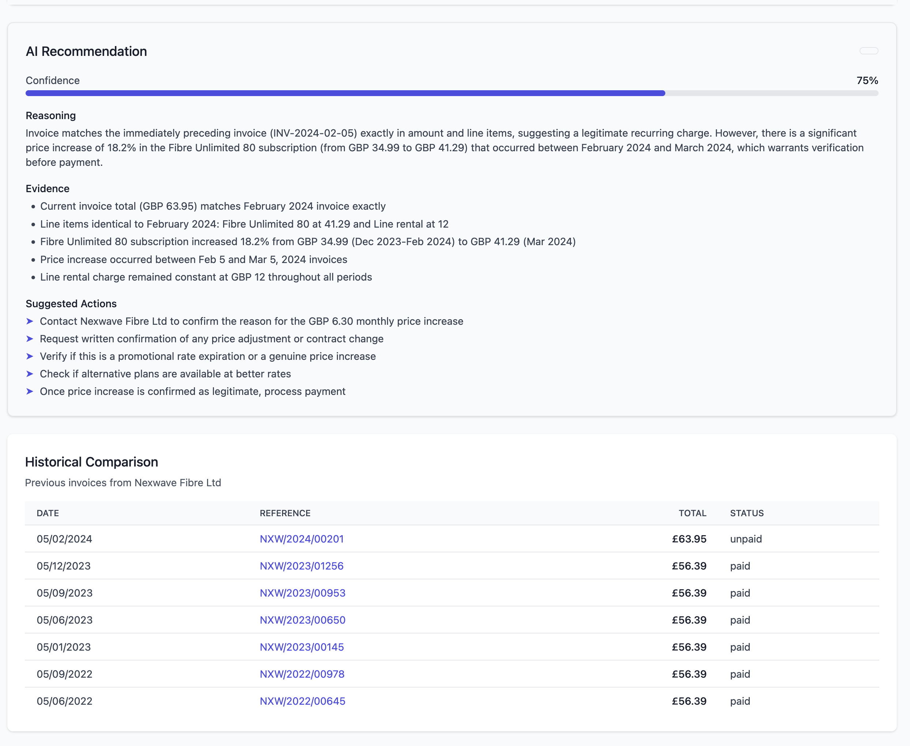
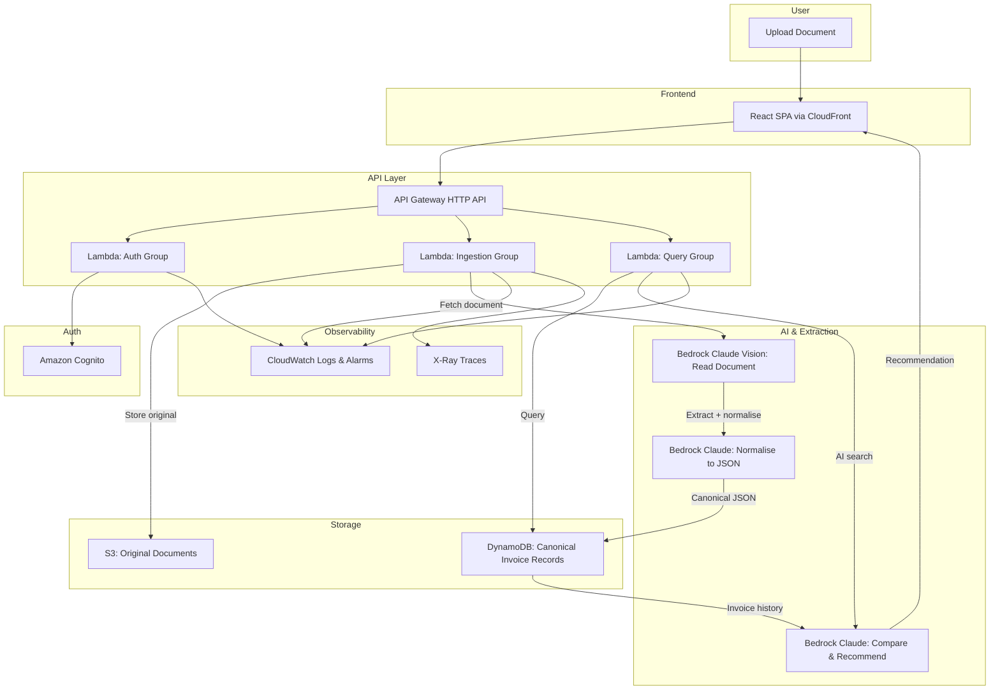

# InvoiceIQ

> An AI agent that turns the pile of bills, invoices, and subscription charges in someone's life into a single searchable, normalised record -- and tells them what to actually do about each one.

   

## Screenshots

| Dashboard | Invoice Detail & AI Recommendation |
|---|---|
|  |  |


## Demo Video

[](https://www.youtube.com/watch?v=igqqwThtf-o)


---

## The Problem

A new invoice arrives and you do not know whether it is legitimate, whether you already paid it, whether the amount changed since last time, whether you still use the service, or whether you should challenge it. Across utilities, telecoms, SaaS subscriptions, insurance, and council bills, a typical UK sole trader handles 10-200 invoices a year with no single view of what is happening.

## The Solution

InvoiceIQ extracts data from any uploaded document (PDF, photo, scan), normalises it into a canonical JSON schema, stores it alongside your full invoice history, and uses AI to compare the new invoice against your historical patterns. It then generates a plain-English recommendation: pay, challenge, investigate, or cancel.

## Key Features

- **Universal document ingestion** - Upload PDFs, photos, or scans (up to 5 MB). A Bedrock Claude vision model reads the document directly.
- **Canonical normalisation** - Every invoice is stored as one consistent JSON record regardless of source format.
- **AI-powered recommendations** - Bedrock Claude compares each invoice against your history for that vendor and returns one of seven verdicts with cited evidence, a confidence level and a suggested next step.
- **Six demo stories** - Price rise detection, duplicate invoice flagging, overlapping SaaS licence detection, estimated reading anomaly, new line item alerting, and legitimate PAY confirmation.
- **Cross-vendor search** - Query your entire invoice corpus in natural language.
- **Correct extraction errors** - Fix any header field the AI misread. Correcting a vendor name regroups the invoice with that vendor's history and triggers re-analysis.
- **Sample data on demand** - Load a 20-invoice synthetic corpus into an empty account with one click, covering all six stories.
- **Spend trend and due dates** - Six-month spend chart, plus overdue and due-soon indicators on unpaid invoices.
- **Subscription waste analysis** - Detects recurring charges, overlapping licences and annualised cost.
- **Account controls** - Export every record as JSON, or permanently delete your account and all its data.
- **Cost-aware architecture** - Per-invoice processing costs under $0.05 with built-in budget alarms.

---

## Live Demo

| | |
|---|---|
| **URL** | [https://invoiceiq.igorbond.com](https://invoiceiq.igorbond.com) |
| **Username** | `demo@invoiceiq.example` |
| **Password** | `Demo1234!Secure` |

The demo environment is pre-seeded with 50 synthetic invoices across 10 fictional vendors spanning 24 months. No real personal data is used anywhere in the system.

---

## How Kiro Was Used

This project was built entirely with Kiro guiding the development process through steering files, specifications, and automated hooks. Below is a detailed walkthrough of how each Kiro feature contributed.

### Steering Files: Locking Decisions Early

Kiro steering files live at the repository root in [`.kiro/steering/`](.kiro/steering/) and act as immutable constraints that every subsequent generation must respect:

| Steering File | Purpose |
|---|---|
| [`.kiro/steering/product.md`](.kiro/steering/product.md) | Locks the product definition: one-line pitch, core user pain, primary user persona (UK sole trader, 10-200 invoices/year), the differentiator (canonical JSON normalisation), and explicit non-goals (no bank integration, no payment execution, no accounting ledger, no multi-tenant, no mobile app). |
| [`.kiro/steering/tech.md`](.kiro/steering/tech.md) | Locks every technology choice: React + Vite + Tailwind frontend, AWS Lambda Node.js 20 backend, Cognito auth, S3 + DynamoDB storage, Textract OCR, Bedrock Claude AI, CDK v2 IaC, Vitest testing, ESLint + Prettier standards. These cannot be changed without explicit approval. (Textract was later dropped in favour of a single Bedrock vision call — see "Where Kiro's Output Needed Correction". The steering file is left as originally written so the record of the decision stays honest.) |
| [`.kiro/steering/structure.md`](.kiro/steering/structure.md) | Enforces the monorepo layout rule and the single-source-of-truth rule: the canonical invoice schema lives only in `/packages/schema` and both `/api` and `/web` must import from there. No other file may redefine invoice fields. |
| [`.kiro/steering/hackathon.md`](.kiro/steering/hackathon.md) | Encodes the 7 non-negotiable submission rules: `.kiro/` committed, no real PII, seeded demo always works, README completeness, attribution, free demo for judges, scope cuts over unfinished features. |

These steering files meant that every time Kiro generated code, it already knew the boundaries. There was no drift between "what we decided" and "what gets generated."

### The Spec Cycle: Requirements, Design, Tasks

The spec for the foundation and infrastructure layer lives in [`.kiro/specs/foundation-and-infra/`](.kiro/specs/foundation-and-infra/) and follows a three-stage cycle:

**Stage 1: Requirements** ([`requirements.md`](.kiro/specs/foundation-and-infra/requirements.md))

Kiro generated 10 testable requirements (R1.1 through R1.10) covering:
- R1.1: Monorepo scaffold with npm workspaces
- R1.2: CDK bootstrapping (S3, DynamoDB, API Gateway, CloudFront)
- R1.3: Least-privilege IAM roles per Lambda group
- R1.4: Structured JSON logging with PII redaction
- R1.5: CloudWatch alarms with configurable thresholds
- R1.6: SPA hosting via CloudFront with compression and SPA routing
- R1.7: Local development (Vite HMR + local Lambda harness)
- R1.8: CI readiness (GitHub Actions)
- R1.9: Security baseline (WAF, KMS, no public S3)
- R1.10: Cost controls (AWS Budgets)

Each requirement follows the "When X, the system shall Y" format, making them independently verifiable.

**Stage 2: Design** ([`design.md`](.kiro/specs/foundation-and-infra/design.md))

From those 10 requirements, Kiro produced a 13-section architecture document covering:
- CDK stack structure and naming conventions
- DynamoDB single-table design with access patterns
- S3 bucket structure with per-user key prefixes
- API Gateway route mapping
- CloudFront configuration with cache behaviours
- Lambda function groups with memory/timeout/IAM specifications
- Observability setup (structured logs, X-Ray, alarms)
- CI/CD pipeline design
- Local development approach
- Security controls (WAF rules, KMS, SSM)
- Cost controls (Budgets, SNS)
- Project dependencies per workspace
- CDK construct choices table

**Stage 3: Tasks** ([`tasks.md`](.kiro/specs/foundation-and-infra/tasks.md))

The design was broken into 16 ordered tasks with:
- Exact file paths to create or modify
- Code snippets and configuration details
- Acceptance criteria for each task
- A dependency graph (Task 8 blocks Tasks 9-10, Task 1 blocks all others, etc.)

This meant implementation was mechanical: pick the next unblocked task, follow its spec, verify its acceptance criteria, commit.

### Where Kiro's Output Needed Correction

Kiro is not infallible. Here are specific cases where its generated output needed manual intervention:

1. **CDK construct choices** - Kiro initially suggested `OAI` (Origin Access Identity) for CloudFront-to-S3 access. This is a legacy approach; AWS now recommends `OAC` (Origin Access Control). The design was corrected to use `S3OriginAccessControl`.

2. **WAF scope** - The initial CDK code used `scope: 'REGIONAL'` for the WAF WebACL. Since the WebACL protects a CloudFront distribution, it must be `scope: 'CLOUDFRONT'` and deployed in `us-east-1`. This required restructuring the stack dependencies.

3. **Lambda entry paths** - Kiro's design referenced `api/dist/handlers/auth/index.handler` as the Lambda handler path. With `NodejsFunction` (which bundles via esbuild), the entry path should point to the TypeScript source file, not compiled output. The actual entry is the `.ts` file and CDK handles transpilation.

4. **Fixture generation dependencies** - The seed script required GraphicsMagick (`gm`) as a system dependency for `pdf2pic`. This was not in the original spec and had to be documented with a preflight check.

5. **Invoice date spans** - The initial fixture set covered 12 months. For meaningful trend detection (the core differentiator), the corpus needed extending to 24 months of history, requiring additional invoice generation back to May 2022.

6. **Textract was not usable** - The spec called for Amazon Textract `AnalyzeExpense`. It returned `SubscriptionRequiredException` — Textract needs a paid subscription unavailable on free-tier accounts. Replaced with a single Bedrock Claude vision call that reads the document and normalises it in one step, removing a service dependency and a pipeline stage.

7. **Deprecated Bedrock model IDs, and inference profiles** - The generated code used `anthropic.claude-3-haiku-20240307-v1:0`, which was rejected as legacy. Newer models then rejected direct invocation entirely, requiring a region-prefixed *inference profile* ID (`eu.anthropic.claude-haiku-4-5-...`) rather than a bare model ID.

8. **API Gateway v1 vs v2 event shapes** - Handlers read `event.path` and `event.httpMethod`, which are REST API (v1) fields. The HTTP API sends `rawPath` and `requestContext.http.method`, so every route silently 404'd until the handlers accepted both shapes.

9. **Missing IAM actions, failing silently** - Several endpoints were generated without the permissions they needed: `AdminConfirmSignUp` (so signup created accounts that could never sign in), `s3:ListBucket` and `dynamodb:DeleteItem` (so invoice deletion failed), and KMS grants for presigned uploads. The signup case was worst because the failure was caught and logged at WARN, so the API still returned `201 Created`.

10. **Error messages discarded** - The API returns errors as `{ error: "..." }` but the generated client read `error.message`, which was always undefined. Every failure surfaced as `Request failed: 400`, hiding the real reason. Fixing the key mapping made the whole app's error handling useful.

11. **A session-restore race** - Auth state was restored in a `useEffect`. Because React runs child effects before parent effects, route guards read `isAuthenticated === false` and redirected away before the provider restored the session. Initialising synchronously via a lazy `useState` initialiser fixed it.

12. **Sort key format drift** - The seed script wrote GSI sort keys prefixed with `DATE#`, while the shared key builders produced bare ISO dates. Since `'D'` sorts above `'9'`, prefixed keys fell outside the query range and date filtering silently returned nothing.

These corrections demonstrate that Kiro accelerates development significantly but requires an engineer who understands the domain to validate and adjust its output. The recurring theme is worth naming: the failures that cost the most time were not syntax errors, which surface immediately, but **silent** ones — missing IAM permissions swallowed by a `catch`, event fields that were simply `undefined`, and sort keys that were structurally valid but sorted outside the intended range.

---

## Architecture

### System Diagram



### Data Flow: Upload to Recommendation

1. **Upload** - User uploads a PDF, photo, or scan through the React SPA.
2. **Store original** - The ingestion Lambda stores the raw document in S3 under the user's prefix (`users/{userId}/invoices/{invoiceId}/original.pdf`), encrypted with KMS.
3. **Extraction and normalisation** - The document is fetched back from S3 and passed to a Bedrock Claude vision model as a multimodal input, which reads it and returns the canonical invoice JSON in a single call — vendor, dates, totals, tax and line items.

   > **Design change:** the original spec used Amazon Textract `AnalyzeExpense` for OCR, then Bedrock for normalisation. Textract requires a paid subscription that is not available on free-tier AWS accounts, so it was replaced with a single Bedrock vision call. This removed a service dependency and a pipeline stage. See "Where Kiro's Output Needed Correction" below.
5. **Store canonical** - The normalised invoice record is written to DynamoDB using the single-table design, indexed for querying by vendor, date, and status.
6. **AI recommendation** - Bedrock Claude receives the new invoice alongside the user's historical invoices for that vendor (queried via GSI1) and generates a recommendation: pay, challenge, investigate, or cancel.
7. **Display** - The frontend shows the invoice details, AI recommendation, and supporting evidence (e.g., "Price increased 18% since last invoice, contract expired 3 weeks ago").

---

## Canonical Invoice JSON Schema

Every invoice in InvoiceIQ is stored using this canonical schema (defined in [`packages/schema/`](packages/schema/)):

```typescript
// Canonical Invoice Schema (Zod)
const LineItemSchema = z.object({
  description: z.string(),
  quantity: z.number(),
  unitPrice: z.number(),
  amount: z.number(),
  vatRate: z.number().optional(),
});

const InvoiceSchema = z.object({
  invoiceId: z.string(),           // Unique identifier (e.g., "INV-NXW-2024-0201")
  vendorId: z.string(),            // Normalised vendor slug (e.g., "nexwave-fibre")
  vendorName: z.string(),          // Display name (e.g., "Nexwave Fibre Ltd")
  issueDate: z.string(),           // ISO date (e.g., "2024-02-05")
  dueDate: z.string(),             // ISO date
  referenceNumber: z.string(),     // Vendor's reference
  lineItems: z.array(LineItemSchema),
  subtotal: z.number(),
  vatAmount: z.number(),
  total: z.number(),
  currency: z.string(),            // ISO 4217 (e.g., "GBP")
  status: z.enum(["unpaid", "paid", "disputed", "cancelled"]),
  category: z.string(),            // e.g., "broadband", "electricity", "saas"
  metadata: z.record(z.unknown()), // Vendor/story-specific fields
});
```

### Worked Example: Price Rise Detection

The invoice below (from [`fixtures/invoices/nexwave-fibre-2024-02-001.json`](fixtures/invoices/nexwave-fibre-2024-02-001.json)) triggers InvoiceIQ's price-rise detection story:

```json
{
  "invoiceId": "INV-NXW-2024-0201",
  "vendorId": "nexwave-fibre",
  "vendorName": "Nexwave Fibre Ltd",
  "issueDate": "2024-02-05",
  "dueDate": "2024-02-20",
  "referenceNumber": "NXW/2024/00201",
  "lineItems": [
    {
      "description": "Fibre Unlimited 80 - Monthly subscription",
      "quantity": 1,
      "unitPrice": 41.29,
      "amount": 41.29,
      "vatRate": 20
    },
    {
      "description": "Line rental",
      "quantity": 1,
      "unitPrice": 12.00,
      "amount": 12.00,
      "vatRate": 20
    }
  ],
  "subtotal": 53.29,
  "vatAmount": 10.66,
  "total": 63.95,
  "currency": "GBP",
  "status": "unpaid",
  "category": "broadband",
  "metadata": {
    "contractStartDate": "2022-01-15",
    "contractEndDate": "2024-01-14",
    "priceIncreasePercent": 18,
    "priceIncreaseAppliedTo": "subscription-only",
    "previousSubscriptionPrice": 34.99,
    "previousTotal": 56.39,
    "noticeSent": false,
    "story": "price-rise-triggered"
  }
}
```

**What InvoiceIQ detects:** The subscription price jumped from GBP 34.99 to GBP 41.29 (an 18% increase). The contract ended 3 weeks before this invoice was issued. No price-increase notice was sent. InvoiceIQ recommends: *"Challenge this invoice. Your contract expired on 2024-01-14 and the provider applied an 18% price increase without notice. You may be entitled to exit without penalty or negotiate a new rate."*

---

## Setup and Local Development

### Prerequisites

- Node.js >= 20.0.0
- npm >= 9.0.0
- AWS CLI v2 (configured with credentials)
- Git

### Clone and Install

```bash
git clone https://github.com/igorbnd/hackathon08.git
cd hackathon08
npm install
```

This installs dependencies for all workspaces (`packages/schema`, `api`, `web`, `infra`) automatically via npm workspaces.

### Environment Variables

Copy the example environment file and fill in your values:

```bash
cp .env.example .env
```

See [`.env.example`](.env.example) for all required variables and their descriptions.

### Running Locally

**Frontend (React SPA with HMR):**

```bash
cd web
npm run dev
# Starts on http://localhost:5173
# API calls proxy to http://localhost:3001
```

**Backend (Local Lambda harness):**

```bash
cd api
npm run dev
# Starts Express server on http://localhost:3001
# Wraps Lambda handlers for local invocation
```

### Building

```bash
# Build all workspaces
npm run build

# Type-check without emitting
npm run typecheck

# Lint
npm run lint

# Format
npm run format
```

---

## Deployment

> **Full deployment runbook:** See [`docs/deployment.md`](docs/deployment.md) for the complete step-by-step guide including CDK bootstrap, DNS record setup, verification checklist, rollback, and teardown.

### Quick Overview

InvoiceIQ deploys across two AWS regions:
- **us-east-1** - ACM certificate (DNS validated) + WAF WebACL (CloudFront scope)
- **eu-west-2** - All application stacks (Storage, Network, Compute, Observability, Cost)

The deployment requires two manual DNS records in Cloudflare at specific points during the deploy process. Both records must be set to **DNS only (grey cloud, proxy OFF)**. See the [full runbook](docs/deployment.md) for exact instructions.

### Deploy

```bash
# Bootstrap CDK in both regions (first time only)
npx cdk bootstrap aws://ACCOUNT_ID/eu-west-2
npx cdk bootstrap aws://ACCOUNT_ID/us-east-1

# Deploy (will pause for DNS validation - see docs/deployment.md)
./scripts/deploy.sh --stage prod
```

### Seed Demo Data

```bash
npm run seed
```

Creates a demo user and 50 synthetic invoices:
- **Email:** `demo@invoiceiq.example`
- **Password:** `Demo1234!Secure`

### Teardown

```bash
./scripts/destroy.sh --stage prod
```

### Preview Changes

```bash
cd infra
npx cdk diff -c stage=prod
```

---

## Testing

### Unit Tests

```bash
# Run all workspace tests
npm run test

# Run with watch mode
npm run test:watch

# Run tests for a specific workspace
cd api && npx vitest run
cd web && npx vitest run
```

### CDK Synthesis Validation

```bash
cd infra
npx cdk synth
```

This validates all CloudFormation templates without deploying.

### Manual Testing Guide (5 Minutes for Judges)

Either sign in with the pre-seeded demo account, or create your own and click **Load sample data** — both give you the same 6 detection stories.

1. **Sign in** - Use `demo@invoiceiq.example` / `Demo1234!Secure`. Or create an account: no email confirmation is required, and you land straight on the dashboard.
2. **Load sample data** *(new accounts only)* - The empty dashboard offers a one-click button that seeds 20 synthetic invoices across 6 vendors.
3. **Read the dashboard** - Spend-by-month chart, unpaid and overdue counts, and overdue / due-soon badges on unpaid invoices. Filter by vendor using the dropdown.
4. **Check the headline recommendation** - Open the most recent **Nexwave Fibre Ltd** invoice. It should detect an ~18% subscription price rise after contract end, cite the specific prior invoices as evidence, and suggest querying the vendor. Scroll down for the historical comparison table.
5. **Try the other stories** - **Pinnacle Office Supplies** has the same invoice twice under different references. **CloudDeck Pro** has two overlapping licences. **Greendale Energy** has an estimated reading well above its rolling mean. **Swiftline Telecom** is unremarkable and should simply be PAY.
6. **Upload a document** - Drag in any invoice PDF or image under 5 MB and watch the status move through queued → extracting → normalising → analysing → ready.
7. **Correct an extraction error** - On any invoice, click **Correct details** and change a field. Correcting the vendor name regroups it with that vendor's history and triggers re-analysis.
8. **Search** - Ask something in plain English, e.g. "show me everything from Nexwave".
9. **Subscriptions** - Recurring charges grouped by vendor with annualised cost and overlap warnings.
10. **Account** - Export all records as JSON. Account deletion also lives here — please use a throwaway account if you want to test it, not the demo one.

### CI Pipeline

The [GitHub Actions workflow](.github/workflows/ci.yml) runs on every push and pull request:
- ESLint
- TypeScript type-checking
- Vitest unit tests
- CDK synth validation

---

## Costs

### Per-Invoice Processing Cost

| Service | Operation | Cost |
|---------|-----------|------|
| Amazon Bedrock (Claude Haiku 4.5) | Vision extraction + normalisation, single call on the document image | ~$0.01 - $0.03 |
| Amazon Bedrock (Claude Haiku 4.5) | Recommendation (~2000 input tokens, ~500 output tokens) | ~$0.0011 |
| AWS Lambda | Ingestion (512MB, ~5s) | ~$0.00004 |
| AWS Lambda | Query (256MB, ~1s) | ~$0.000004 |
| Amazon DynamoDB | 3 writes (PutItem) | ~$0.00000375 |
| Amazon S3 | 2 PUTs + storage | ~$0.00001 |
| **Total per invoice** | | **~$0.02 - $0.05** |

### Monthly Demo Environment Cost

| Service | Estimate | Notes |
|---------|----------|-------|
| Bedrock | ~$0.50 | Vision extraction on uploads, plus recommendations. Cached per invoice, so re-viewing costs nothing |
| Lambda | ~$0.10 | Invocations during judge testing |
| DynamoDB (on-demand) | ~$0.01 | $1.25/M writes, $0.25/M reads |
| S3 | ~$0.05 | Storage + requests |
| CloudFront | ~$1.00 | Free tier likely covers it |
| CloudWatch | ~$0.50 | Logs, metrics, alarms |
| Cognito | Free | < 50,000 MAU |
| **Total monthly estimate** | **~$5 - $15** | Light judge usage |

### Bedrock Notes

- Model: `eu.anthropic.claude-haiku-4-5-20251001-v1:0` (an EU **inference profile** — newer Claude models reject direct model-ID invocation)
- Image input dominates the per-invoice cost; text-only calls are an order of magnitude cheaper
- Recommendations are cached on the invoice record, so viewing one repeatedly costs nothing. A correction invalidates the cache and triggers one re-analysis.

### DynamoDB On-Demand Pricing

- Write: $1.25 per million write request units
- Read: $0.25 per million read request units

### S3 Pricing

- Storage: $0.023 per GB/month
- PUT requests: $0.005 per 1,000 requests
- GET requests: $0.0004 per 1,000 requests

---

## Rate Limits and Usage Restrictions

| Service | Limit | Notes |
|---------|-------|-------|
| API Gateway | 1,000 req/s burst, 500 req/s steady | Per-stage throttling |
| WAF | 2,000 requests per 5 minutes per IP | Rate-based rule |
| Bedrock (Claude) | Account-level requests/minute, typically low on new accounts | Extraction or recommendations may need retrying under load |
| Lambda concurrency | 50 reserved (dev), 200 (prod) | Per function group |
| Lambda timeout | 60s (ingestion) | Long multi-page documents may time out — processing is synchronous |
| Cognito | 50,000 MAU free tier | Email + password auth |
| Cognito email | Low daily cap on the built-in sender | Affects password reset; SES needed for real volume |
| Uploads | **5 MB per document**, PDF/PNG/JPEG | Rejected before upload in the browser and again in the ingestion handler |

**Bedrock model access must be enabled before deploying.** Two things catch people out:

1. Anthropic models require a **use case details form** to be submitted in the Bedrock console before they can be invoked.
2. Newer Claude models **cannot be invoked by bare model ID** — they require a region-prefixed inference profile. Use `aws bedrock list-inference-profiles --region <region>` to find the right identifier, not `list-foundation-models`.

---

## Known Limitations

This is a hackathon prototype, not a commercial product. The gaps below are known and deliberate — each one was a scope decision, not an oversight.

| Limitation | Detail |
|------------|--------|
| **5 MB upload cap** | Larger documents are rejected. The whole pipeline runs inside one Lambda invocation, so the file has to fit comfortably in memory alongside the base64 payload sent to Bedrock. |
| **Synchronous processing** | Upload, extraction, normalisation and recommendation all happen in a single 60-second Lambda. A long multi-page scan can time out. A production build would split this into an SQS-driven pipeline with per-stage retries. |
| **Line items are not editable** | You can correct header fields (vendor, dates, totals, currency, status) but not individual line items. The correction form states this in the UI rather than hiding it. |
| **Corrections are not reused** | Fixing a field updates that one invoice only. There is no feedback loop back into the extraction prompt, so the same vendor can be misread the same way twice. |
| **Relaxed auth for a prototype** | Sign-up auto-confirms accounts with no email verification, so anyone can register with any address. Fine for a demo, unacceptable for real data. |
| **Single region, no backups** | Everything lives in `eu-west-2` (except the CloudFront certificate and WAF, which must be in `us-east-1`). No cross-region replication, no point-in-time recovery, no disaster-recovery plan. |
| **No multi-tenancy beyond user partitioning** | Data is isolated by DynamoDB partition key per user. There are no organisations, no shared workspaces, no roles. |
| **Recommendations are advisory only** | The AI suggests an action and a confidence score. Nothing is ever paid, cancelled or actioned automatically, and the output should not be treated as financial advice. |
| **Subscription analysis is heuristic** | Recurring charges are inferred from vendor and amount patterns across the invoices you have uploaded. Sparse data produces weak conclusions. |
| **No audit trail on corrections** | An edited field overwrites the extracted value. The original AI output is not retained for comparison. |

---

## Security and Privacy

### Data Protection

- **No real personal data** is used anywhere in this project. All invoices are synthetic, all vendors are fictional, and the demo user is a placeholder.
- **KMS encryption** on the S3 documents bucket (dedicated CMK per environment).
- **Block all public access** on all S3 buckets.
- **SSL-only** bucket policies reject non-HTTPS requests.
- **DynamoDB PITR** (Point-in-Time Recovery) enabled for data durability.
- **Per-user key prefixes** in S3 prevent cross-user document access.

### Network Security

- **WAF WebACL** attached to CloudFront with AWS managed rule groups:
  - CommonRuleSet
  - KnownBadInputsRuleSet
  - SQLiRuleSet
  - AmazonIpReputationList
  - Rate limiting (2,000 req/5min per IP)
- **HTTPS only** via CloudFront (HTTP redirects to HTTPS, TLS 1.2 minimum).
- **CORS** restricted to known origins.

### Authentication

- **Amazon Cognito** user pools with email + password sign-in.
- **JWT authorizer** on all API Gateway routes except `/auth/*`.
- **No secrets in code** - all secrets via SSM Parameter Store SecureString.

### Logging and PII

- Structured JSON logs never contain PII (email, name, address, document content).
- Only IDs and metadata are logged.
- X-Ray traces provide request correlation without exposing sensitive data.

---

## Attribution

### Frameworks and Libraries

| Package | License | Usage |
|---------|---------|-------|
| [React](https://react.dev/) | MIT | UI framework |
| [react-dom](https://react.dev/) | MIT | React DOM renderer |
| [react-router-dom](https://reactrouter.com/) | MIT | Client-side routing |
| [Vite](https://vitejs.dev/) | MIT | Build tool and dev server |
| [@vitejs/plugin-react](https://vitejs.dev/) | MIT | React support for Vite |
| [TailwindCSS](https://tailwindcss.com/) | MIT | Utility-first CSS |
| [PostCSS](https://postcss.org/) | MIT | CSS processing |
| [Autoprefixer](https://github.com/postcss/autoprefixer) | MIT | CSS vendor prefixing |
| [Zod](https://zod.dev/) | MIT | Schema validation |
| [Express](https://expressjs.com/) | MIT | Local dev server |
| [TypeScript](https://www.typescriptlang.org/) | Apache-2.0 | Language |
| [tsx](https://github.com/privatenumber/tsx) | MIT | TypeScript execution |

### AWS and Infrastructure

| Package | License | Usage |
|---------|---------|-------|
| [AWS CDK v2](https://aws.amazon.com/cdk/) | Apache-2.0 | Infrastructure as Code |
| [constructs](https://github.com/aws/constructs) | Apache-2.0 | CDK construct library |
| [@aws-sdk/client-dynamodb](https://github.com/aws/aws-sdk-js-v3) | Apache-2.0 | DynamoDB client |
| [@aws-sdk/client-s3](https://github.com/aws/aws-sdk-js-v3) | Apache-2.0 | S3 client |
| [@aws-sdk/client-textract](https://github.com/aws/aws-sdk-js-v3) | Apache-2.0 | Textract client |
| [@aws-sdk/client-bedrock-runtime](https://github.com/aws/aws-sdk-js-v3) | Apache-2.0 | Bedrock client |
| [@aws-sdk/client-cognito-identity-provider](https://github.com/aws/aws-sdk-js-v3) | Apache-2.0 | Cognito client |
| [aws-xray-sdk](https://github.com/aws/aws-xray-sdk-node) | Apache-2.0 | Distributed tracing |
| [source-map-support](https://github.com/evanw/node-source-map-support) | MIT | Stack trace mapping |

### Testing and Quality

| Package | License | Usage |
|---------|---------|-------|
| [Vitest](https://vitest.dev/) | MIT | Unit testing |
| [ESLint](https://eslint.org/) | MIT | Linting |
| [Prettier](https://prettier.io/) | MIT | Code formatting |

### Fixtures and Generation

| Package | License | Usage |
|---------|---------|-------|
| [PDFKit](http://pdfkit.org/) | MIT | PDF generation for fixtures |
| [pdf2pic](https://github.com/yakovmeister/pdf2image) | MIT | PDF to image conversion for scan fixtures |
| [sharp](https://sharp.pixelplumbing.com/) | Apache-2.0 | Image processing for scan degradation |

### AWS Services Used

Amazon S3, Amazon DynamoDB, AWS Lambda, Amazon API Gateway, Amazon CloudFront, AWS WAF, Amazon Cognito, Amazon Bedrock (Claude), Amazon CloudWatch, AWS KMS, Amazon SNS, Amazon SQS, AWS Budgets.

### Data

All invoice data is **entirely synthetic**. Vendor names, addresses, invoice numbers, and amounts are fictional and generated for demonstration purposes. See [`fixtures/NOTICE.md`](fixtures/NOTICE.md) for details.

---

## Licence

This project is licensed under the [MIT License](LICENSE).

---

## Disclaimer

InvoiceIQ recommendations are **informational only** and do not constitute legal, tax, or financial advice. Users should consult qualified professionals before making financial decisions based on the system's output. The AI-generated recommendations are suggestions based on pattern analysis and may not account for all relevant circumstances.
